# 🧪 LAB 1 — Provisioning Azure SQL Server & Database
## Estimated Duration
⏱ 55 Minutes

## Overview

In this lab, you will create the data foundation of the Text-to-SQL application. You will provision an Azure SQL Server and an Azure SQL Database through the Azure Portal, configure firewall rules, and set up the database schema with sample data using the built-in Query Editor.

## Objectives
- Provision an Azure SQL Server with Microsoft Entra authentication
- Create an Azure SQL Database
- Configure firewall rules 
- Create schema, tables, and insert sample data


---


## Task 1.1 — Create Azure SQL Server

**Description:**
The Azure SQL Server is the logical server that hosts your database. You will configure it with Microsoft Entra-only authentication, which means no SQL username/password — only secure Azure AD identity-based access.

### Steps

**Step 1:** In the azure portal go to the **Azure SQL**, **Select Azure Logical server(1)**.

**Step 2:** Click **Create(2)**.
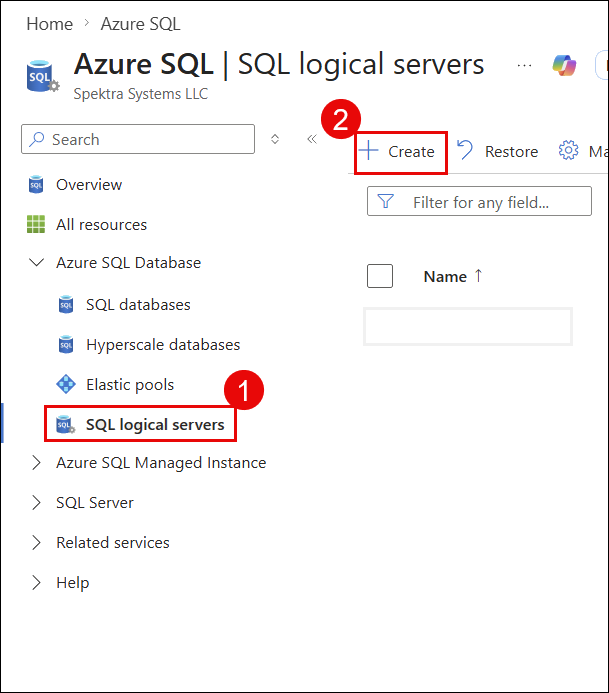


**Step 3:** On the **Basics** tab, fill in:
- **Subscription:** Your subscription
- **Resource Group:** `Your resource group (textsql-rg)`
- **Server Name:** `textsql-sqlserver`(1)
- **Region:** `West US`(2)
- **Authentication Method:** Select **Use Microsoft Entra-only authentication**(3)


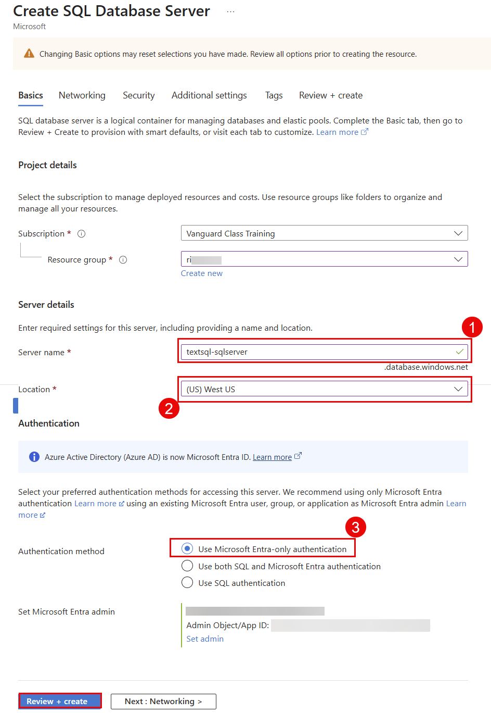

**Step 4:** After filling all the details, Click **Review + Create then click Create**.

**Step 5:** Wait for deployment to complete (2–3 minutes).

**Step 6:** Click **Go to resource** to open the SQL Server.
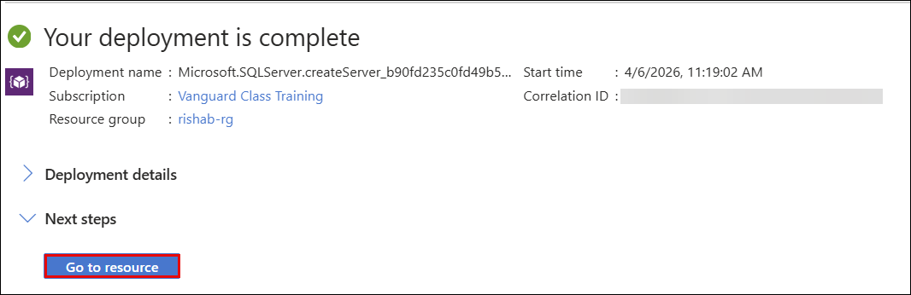

> ✅ **Verify:** Server status shows **Available** and Microsoft Entra Admin **Configured**

---

## Task 1.2 — Configure SQL Server Firewall

**Description:**
By default, Azure SQL Server blocks all external connections. You need to allow Azure services (so your App Service can connect) and optionally your local machine (for testing from your computer).

### Steps

**Step 1:** Inside your SQL Server (`textsql-sqlserver`), go to **Settings → Security → Networking** in the left menu.

**Step 2:** Under **Firewall rules**, find the toggle **Allow Azure services and resources to access this server(2)** and set it to **Yes**.

**Step 3:** Click **+ Add your client IPv4 address(1)** to allow your local machine.
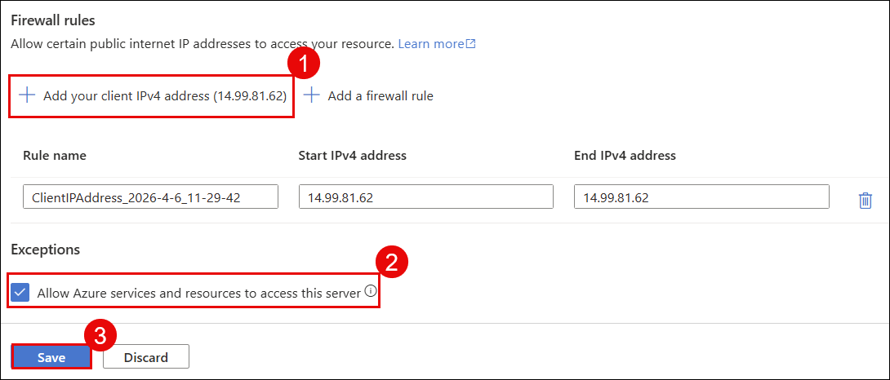

**Step 4:** Click **Save(3)**.

> ✅ **Verify:** You see a green success notification "Saved firewall rules"

---

## Task 1.3 — Create Azure SQL Database

**Description:**
The SQL Database is where your actual data lives — products, customers, and sales records. You will create it under the SQL Server you just provisioned.

### Steps

**Step 1:** Inside the database server (`textsql-sqlserver`), click **+ Create database** at the top.
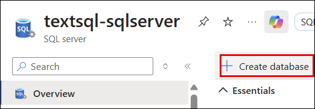

**Step 3:** On the **Basics** tab, fill in:
- **Subscription:** Your subscription
- **Resource Group:** Already selected
- **Database Name(1):** `textsqldb`
- **Server:** It will Select Already created server `textsql-sqlserver`
- **Want to use SQL elastic pool?(2):** No
- **Workload environment(3):** Select **Development**

**Step 4:** Under **Compute + Storage(4)**, click **Configure database**.
- Select **Basic** or **General Purpose (Serverless)**
- Click **Apply**

**Step 5:** Under **Backup storage redundancy(5)**, select **Locally-redundant backup storage**.


**Step 6:** Click **Review + Create(6)**, then click **Create**.

**Step 7:** Wait for deployment (2–3 minutes), then click **Go to resource**.

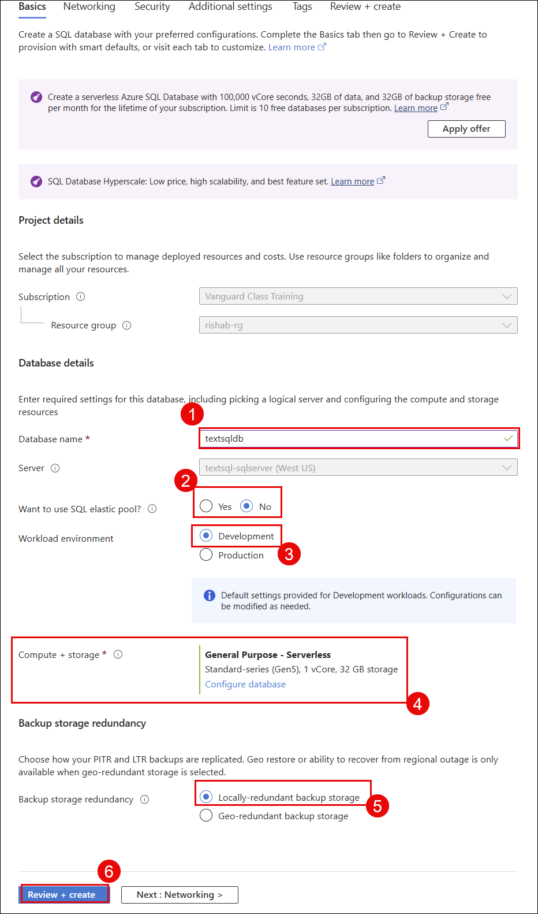

> ✅ **Verify:** Database status shows **Online**
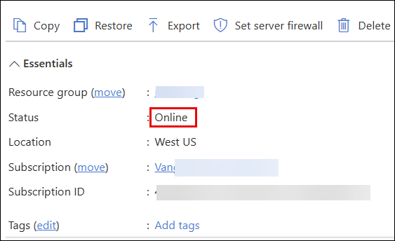
---

## Task 1.4 — Create Schema, Tables & Insert Sample Data

**Description:**
Now that the database is ready, you will use the Azure Portal's built-in **Query Editor** to create your database schema (`SalesLT`), three tables, and insert sample data — all without any external tools.

### Steps

**Step 1:** Inside `textsqldb`, click **Query editor (preview)(1)** in the left menu.

**Step 2:** Sign in using **Microsoft Entra authentication(2)** and click **Connect as(3) (user)**.
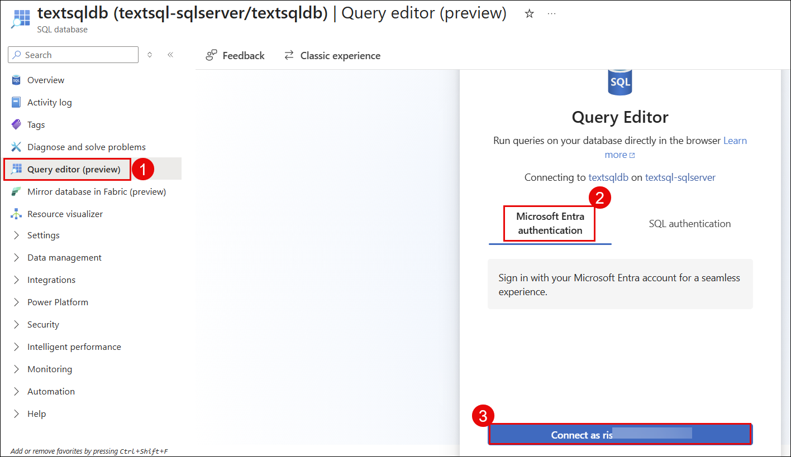


**Step 3:** In the query window,Click on New Query and paste and run the following SQL to create the schema:

```sql
-- Create Schema
IF NOT EXISTS (SELECT * FROM sys.schemas WHERE name = 'SalesLT')
EXEC('CREATE SCHEMA SalesLT')
```
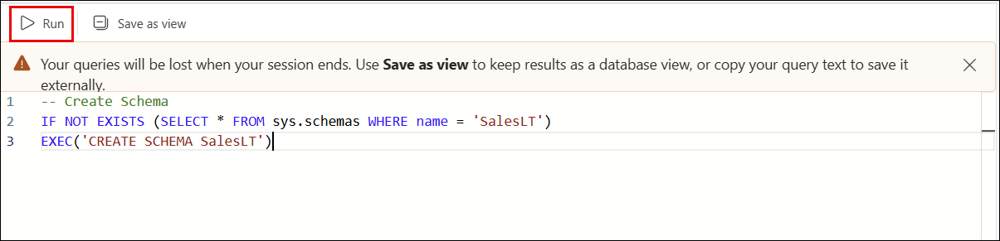
Click **▶ Run**.

```
If it runs successfully, you will see " Query executed successfully" in the Message pane. This means the `SalesLT` schema has been created.
```
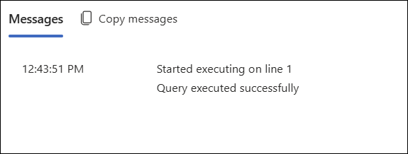

**Step 4:** Click on new query, paste the following, and click **▶ Run**:

```sql
-- Create Customer Table
CREATE TABLE SalesLT.Customer (
    CustomerID   INT IDENTITY(1,1) PRIMARY KEY,
    FirstName    NVARCHAR(50),
    LastName     NVARCHAR(50),
    EmailAddress NVARCHAR(50),
    Phone        NVARCHAR(25),
    CompanyName  NVARCHAR(128),
    ModifiedDate DATETIME DEFAULT GETDATE()
)

-- Create Product Table
CREATE TABLE SalesLT.Product (
    ProductID         INT IDENTITY(1,1) PRIMARY KEY,
    Name              NVARCHAR(50) NOT NULL,
    ProductNumber     NVARCHAR(25) NOT NULL,
    Color             NVARCHAR(15) NULL,
    StandardCost      FLOAT NOT NULL,
    ListPrice         FLOAT NOT NULL,
    Size              NVARCHAR(5) NULL,
    Weight            DECIMAL(8,2) NULL,
    ProductCategoryID INT NULL,
    SellStartDate     DATETIME NOT NULL DEFAULT GETDATE(),
    ModifiedDate      DATETIME DEFAULT GETDATE()
)

-- Create SalesOrderDetail Table
CREATE TABLE SalesLT.SalesOrderDetail (
    SalesOrderID       INT NOT NULL,
    SalesOrderDetailID INT IDENTITY(1,1) PRIMARY KEY,
    OrderQty           SMALLINT NOT NULL,
    ProductID          INT NOT NULL,
    UnitPrice          DECIMAL(10,2) NOT NULL,
    UnitPriceDiscount  DECIMAL(10,2) DEFAULT 0,
    LineTotal          DECIMAL(10,2) NOT NULL,
    ModifiedDate       DATETIME DEFAULT GETDATE()
)
```
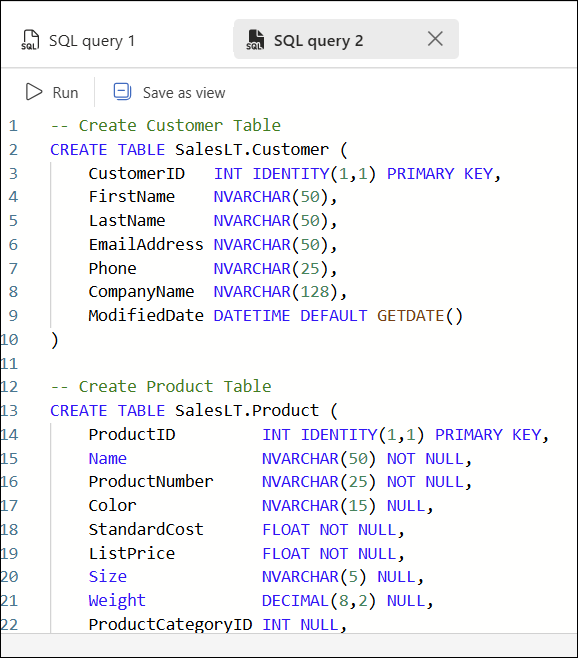


**Step 5:** Click on new query,paste the following, and click **▶ Run**:

```sql
-- Insert Customers
INSERT INTO SalesLT.Customer (FirstName, LastName, EmailAddress, Phone, CompanyName)
VALUES
('James',   'Wilson',   'james.wilson@contoso.com',   '111-222-3333', 'Contoso Ltd'),
('Sarah',   'Johnson',  'sarah.j@fabrikam.com',        '444-555-6666', 'Fabrikam Inc'),
('Michael', 'Chen',     'mchen@northwind.com',          '777-888-9999', 'Northwind Traders'),
('Emily',   'Davis',    'emily.d@adventure.com',        '321-654-9870', 'Adventure Works'),
('Robert',  'Martinez', 'roberto@tailspin.com',         '123-456-7890', 'Tailspin Toys')

-- Insert Products
INSERT INTO SalesLT.Product (Name, ProductNumber, Color, StandardCost, ListPrice, Size)
VALUES
('Mountain Bike Pro',  'MB-PRO-001', 'Black',  550.00, 1099.99, 'L'),
('Road Bike Elite',    'RB-ELT-002', 'Red',    420.00,  849.99, 'M'),
('Touring Helmet',     'HM-TUR-003', 'White',   45.00,   89.99, NULL),
('Cycling Gloves Pro', 'CG-PRO-004', 'Black',   18.00,   34.99, 'S'),
('Hydration Bottle',   'HB-STD-005', 'Blue',     4.50,   12.99, NULL),
('Titanium Bike Lock', 'BL-TIT-006', 'Silver',  28.00,   54.99, NULL),
('Performance Jersey', 'PJ-PRM-007', 'Green',   38.00,   74.99, 'L'),
('Floor Pump Pro',     'FP-PRO-008', 'Black',   22.00,   44.99, NULL),
('Carbon Saddle',      'CS-CBN-009', 'Black',   65.00,  129.99, NULL),
('Clipless Pedals',    'CP-CLX-010', 'Silver',  32.00,   64.99, NULL)

-- Insert SalesOrderDetails
INSERT INTO SalesLT.SalesOrderDetail
(SalesOrderID, OrderQty, ProductID, UnitPrice, UnitPriceDiscount, LineTotal)
VALUES
(1001, 2, 1, 1099.99, 0.00, 2199.98),
(1001, 1, 3,   89.99, 0.00,   89.99),
(1002, 1, 2,  849.99, 0.05,  807.49),
(1002, 3, 5,   12.99, 0.00,   38.97),
(1003, 2, 4,   34.99, 0.00,   69.98),
(1003, 1, 6,   54.99, 0.00,   54.99),
(1004, 1, 1, 1099.99, 0.10,  989.99),
(1004, 2, 7,   74.99, 0.00,  149.98),
(1005, 4, 5,   12.99, 0.00,   51.96),
(1005, 1, 9,  129.99, 0.00,  129.99)
```

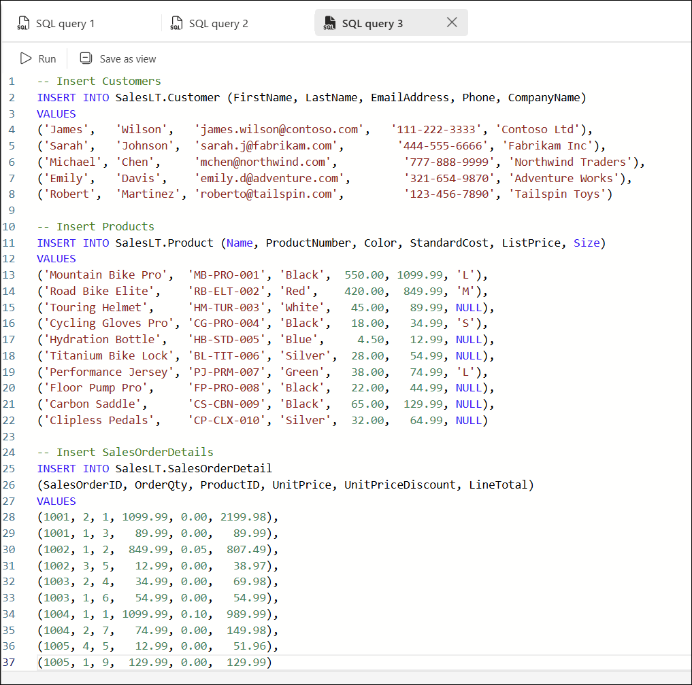

**Step 6:** Verify your data by running:

```sql
SELECT * FROM SalesLT.Product
SELECT * FROM SalesLT.Customer
SELECT * FROM SalesLT.SalesOrderDetail
```

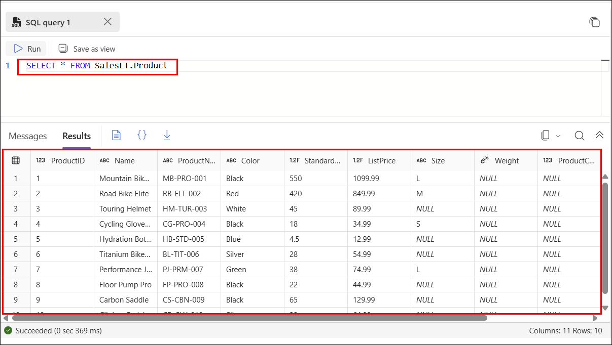

```sql
SELECT * FROM SalesLT.Customer
```
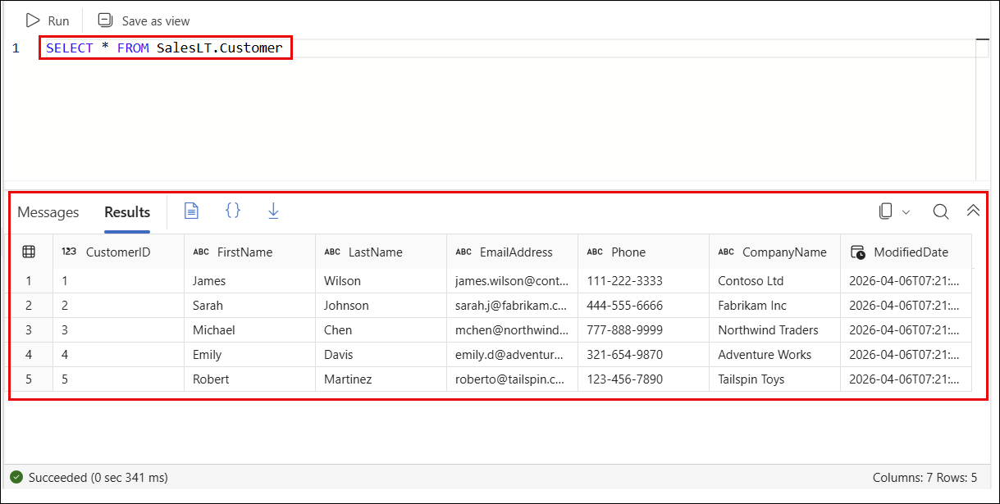

```sql
SELECT * FROM SalesLT.SalesOrderDetail
```
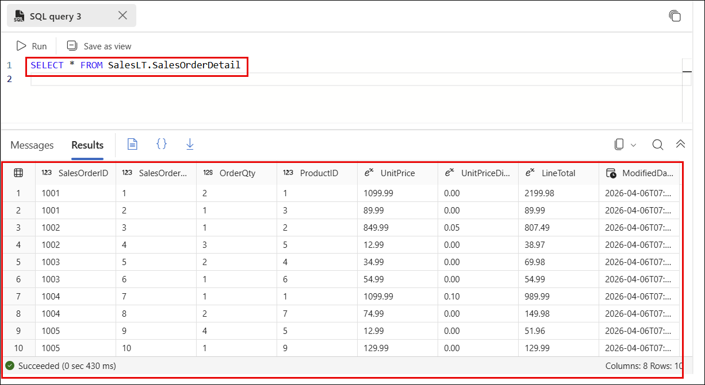

> ✅ **Verify:** All 3 tables return data — 5 customers, 10 products, 10 order lines

---

### ✅ Lab 1 Complete — Checklist

- [ ] Resource Group `textsql-rg` created in West US
- [ ] SQL Server `textsql-sqlserver` created with Entra-only auth
- [ ] Firewall rule — Allow Azure services = YES
- [ ] SQL Database `textsqldb` created and Online
- [ ] Schema `SalesLT` created
- [ ] Tables `Customer`, `Product`, `SalesOrderDetail` created
- [ ] Sample data inserted — 5 customers, 10 products, 10 orders

---

---
