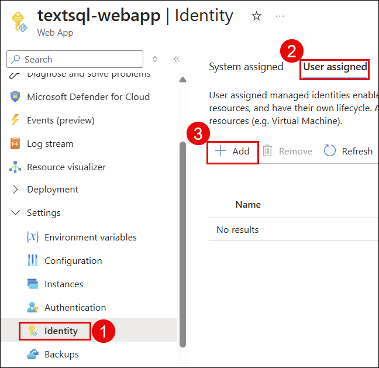

# 🧪 LAB 3 — Configuring Security & Managed Identity

## Overview

In this lab, you will implement enterprise-grade security using Azure Managed Identity. Instead of storing passwords or API keys in your code, your application will use its own Azure identity to authenticate with OpenAI and SQL Database securely. You will create a User Managed Identity, assign it to the App Service, and grant it the correct permissions on each resource.

## Objectives
- Create a User Assigned Managed Identity
- Assign the identity to the App Service
- Grant OpenAI access via RBAC role assignment
- Grant SQL Database access via identity configuration

## Estimated Duration
⏱ 30 Minutes

---

## Task 3.1 — Create User Managed Identity

**Description:**
A User Assigned Managed Identity is a standalone Azure identity resource that can be assigned to multiple services. Your App Service will use this identity to authenticate with Azure OpenAI and Azure SQL Database — no passwords required anywhere.

### Steps

**Step 1:** In the Azure Portal search bar, type **Managed Identities** and select it.


**Step 2:** Click **+ Create**.


**Step 3:** Fill in:
- **Subscription:** Your subscription
- **Resource Group:** `textsql-rg`
- **Region:** `West US`
- **Name:** `textsql-identity`


**Step 4:** Click **Review + Create**, then click **Create**.


**Step 5:** Click **Go to resource** and note the **Client ID** and **Principal ID** — you may need these later.


```
Managed Identity overview showing textsql-identity with Client ID and Object Principal ID
```

> ✅ **Verify:** Managed Identity `textsql-identity` created successfully

---

## Task 3.2 — Assign Managed Identity to App Service

**Description:**
Now you will attach the `textsql-identity` to your App Service. Once attached, the App Service will automatically use this identity when making requests to other Azure services.

### Steps

**Step 1:** Navigate to your App Service `textsql-webapp`.

**Step 2:** In the left menu, go to **Settings → Identity(1)**.

**Step 3:** Click the **User assigned(2)** tab.

**Step 4:** Click **+ Add(3)**.



**Step 5:** In the Dropdown, Select `textsql-identity`, select it, and click **Add**.


> ✅ **Verify:** `textsql-identity` appears under User assigned identities with Status = Assigned

---

## Task 3.3 — Grant OpenAI Access to Managed Identity

**Description:**
You will assign the **Cognitive Services OpenAI User** RBAC role to your Managed Identity on the Azure OpenAI resource. This allows your App Service to call the OpenAI API using its identity — without any API key in the code.

### Steps

**Step 1:** Navigate to your Azure OpenAI resource `textsql-openai`.

**Step 2:** In the left menu, click **Access Control (IAM)(1)**.
**Step 3:** Click **+ Add(2)**, then select **Add role assignment(3)**.

**Step 4:** On the **Role** tab, search for:
```
Cognitive Services OpenAI User
```
Select it and click **Next**.


**Step 5:** On the **Members** tab:
- **Assign access to:** Select `Managed Identity`
- Click **+ Select members**
- In the dropdown, select **User-assigned managed identity**
- Find and select `textsql-identity`
- Click **Select**


**Step 6:** Click **Review + Assign**, then click **Review + Assign** again to confirm.

**Step 7:** Go to **Access Control (IAM) → Role assignments** tab and verify the role appears.


> ✅ **Verify:** Role assignment shows `textsql-identity` → `Cognitive Services OpenAI User`

---

## Task 3.4 — Grant SQL Database Access to Managed Identity

**Description:**
Your Managed Identity also needs access to the Azure SQL Database. You will do this by running a SQL command in the Query Editor that creates a database user mapped to the Managed Identity.

### Steps

**Step 1:** Navigate to your SQL Database `textsqldb` in the Azure Portal.

**Step 2:** Click **Query editor (preview)** in the left menu.

**Step 3:** Sign in using **Active Directory authentication**.
```
You may encounter this error while logging into the database. It usually occurs when your network changes and your IP address is updated. To resolve it, click on ‘Add your IP address’ in the firewall settings, allow the new IP, and then try logging in again. Changes may take a few minutes to take effect.
```


**Step 4:** In the query window, run the following SQL:

```sql
-- Create a user for the Managed Identity
CREATE USER [textsql-identity] FROM EXTERNAL PROVIDER;

-- Grant the user read and write permissions
ALTER ROLE db_datareader ADD MEMBER [textsql-identity];
ALTER ROLE db_datawriter ADD MEMBER [textsql-identity];
```


**Step 5:** Verify the user was created by running:

```sql
SELECT name, type_desc FROM sys.database_principals
WHERE name = 'textsql-identity'
```


> ✅ **Verify:** Query returns `textsql-identity` with `type_desc = EXTERNAL_USER`

---

### ✅ Lab 3 Complete — Checklist

- [ ] Managed Identity `textsql-identity` created in `textsql-rg`
- [ ] `textsql-identity` assigned to App Service `textsql-webapp`
- [ ] Role `Cognitive Services OpenAI User` assigned to `textsql-identity` on OpenAI resource
- [ ] SQL Database user `textsql-identity` created from external provider
- [ ] `db_datareader` and `db_datawriter` roles granted to `textsql-identity`

---

---